# MeshCore J2ME Client

MeshCore Java ME (MIDP 2.0 / CLDC 1.1) mobile client for MeshCore Companion Radio over Wi-Fi TCP.

This README is user-UI focused: it explains every major screen, what options/buttons you get there, what happens after each action, and the normal flows users follow.

## Get started

- Demo video: [YouTube - MeshCore J2ME: Bringing Mesh network to Old QWERTY Phones](https://youtu.be/3oNSf3yNN1Y)

- Download latest release: [MeshCore J2ME v1.0.0](https://github.com/dobrishinov/MeshCore-J2ME/releases/tag/v1.0.0)
- Build from source: [Go to Build and run](#6-build-and-run)

## UI preview

<table>
  <tr>
    <td align="center">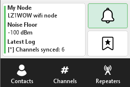 `MainMenuScreen`</td>
    <td align="center">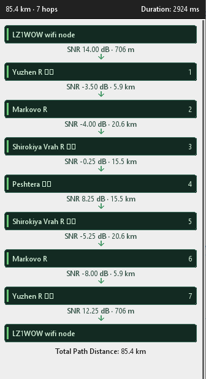 `MapViewCanvas` trace (4)</td>
    <td align="center">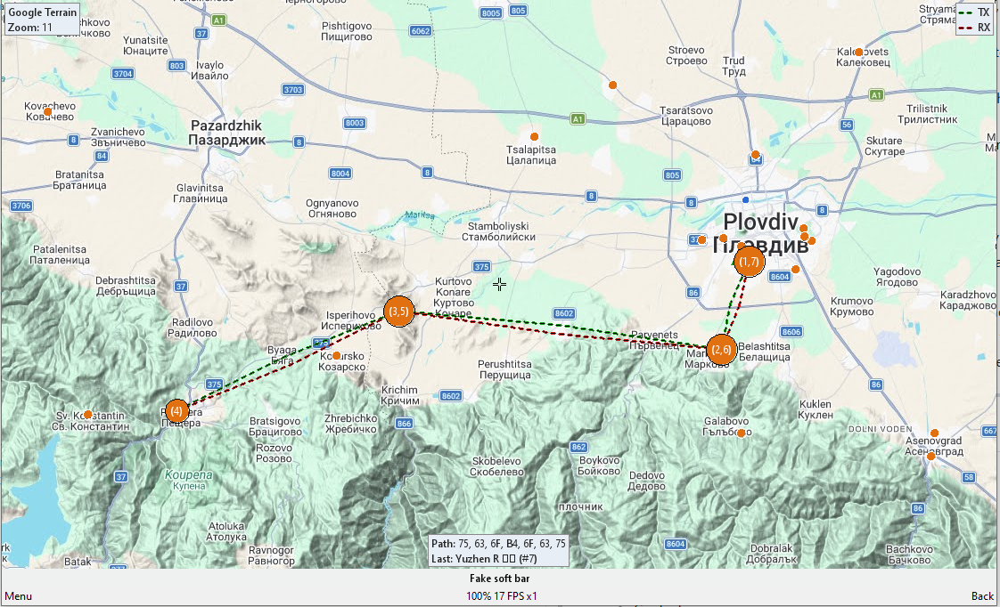 `MapViewCanvas` trace (3)</td>
  </tr>
</table>

---

## Tested Devices & Platforms

- **Nokia Asha 210** — primary tested hardware device.
- **KEmulator (kemnnx64)** — tested on Windows, Linux, and macOS via the [KEmulator emulator](https://github.com/shinovon/KEmulator/releases). This lets you run the app on a desktop computer without a physical device.
- **J2ME-Loader** — also works on Android using [J2ME-Loader](https://github.com/nikita36078/j2me-loader), a J2ME emulator app (install the JAR/JAD and grant network access as needed).

> Any device or emulator supporting **MIDP 2.0 / CLDC 1.1** with TCP networking should work.

<table>
  <tr>
    <td colspan="3" align="center">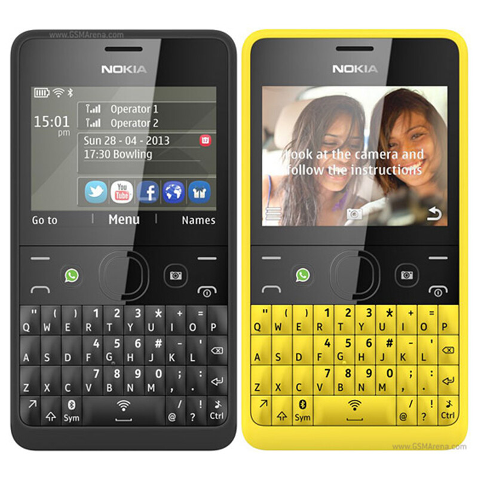 <strong>Nokia Asha 210</strong> — primary tested device</td>
  </tr>
</table>

---

## 1) What the app is for

MeshCore lets you:

- Connect your phone to a MeshCore node by IP/port over Wi-Fi TCP.
- Chat in public channels in real time.
- Send and receive direct messages (DM) to and from contacts.
- Work with repeaters — view discovered repeaters, authenticate when required, request telemetry, and run trace paths through them.
- Manage contacts — add manually or via QR code, view details, copy public keys and coordinates, share your identity with others.
- Manage channels — create private channels with auto-generated secrets, join private or hashtag channels, share channel info via QR.
- Build and edit multi-hop routing paths for direct messages, either by picking repeaters from a list or entering raw path bytes manually.
- Use map-based navigation — view node, contact, and repeater positions on a tiled map, measure distances, and build trace routes visually.
- Run diagnostics:
  - Zero-hop ping — verify direct reachability to a node
  - Manual trace path — build a hop path and trace it step by step
  - Map-based trace path — select hops visually on the map and run the trace
  - Noise floor — live monitoring of the radio noise level
  - Telemetry — request and decode telemetry frames from nodes/repeaters
  - Activity log — inspect protocol and runtime events in real time
- Manage node and app settings — update node parameters, clear message history, and monitor storage usage.

---

## 2) UI experience overview

Typical user session:

1. Open app → `ConnectScreen`
2. Enter node IP/host and TCP port → `Connect`
3. Land on `MainMenuScreen`
4. Navigate via dashboard tiles and the bottom bar:
   - Contacts
   - Channels
   - Repeaters
   - Notifications
   - Favorites
5. Open `More` → `Tools` for trace/map/noise floor/activity diagnostics
6. Use `Back` from any screen to return to the previous context

---

## 3) Screen-by-screen guide (buttons, options, behavior)

---

### 3.1 Connect and entry screens

#### `ConnectScreen`

**Purpose**
Start a session with your MeshCore node.

**What you enter**
- Host/IP address of the node
- TCP port number

**Buttons/commands**
- `Connect`

**What happens**
- App opens a TCP connection and starts the protocol handshake and sync sequence.
- On success: opens `MainMenuScreen`.
- On failure: stays on the connect flow and shows an error notification. You can retry immediately.

---

### 3.2 Main navigation screens

#### `MainMenuScreen` (Canvas dashboard)

**Purpose**
Central navigation hub once connected.

**UI areas**
- Left dashboard card: node info, current noise floor reading, latest status context (last message, last activity).
- Right tiles: Notifications badge + Favorites shortcut.
- Bottom bar: `Contacts` / `Channels` / `Repeaters`.

**Buttons/commands**
- `Select` — opens currently highlighted destination
- `Advert • Zero Hop` — sends advert mode change to zero-hop (direct neighbors only)
- `Advert • Flood` — sends advert mode change to flood/routed (propagates through network)
- `Disconnect` / `Connect To` — closes or starts a node session depending on current state
- `More` — opens the secondary menu (`MoreMenuCanvas`)

**What each action does**
- `Advert • Zero Hop` and `Advert • Flood` control how your node advertises itself to the mesh. Zero-hop keeps advertisements local; flood propagates them further.
- `Disconnect` closes the active TCP session cleanly. The button changes to `Connect To` when disconnected.
- `More` opens the extended menu for adding contacts/channels, sharing, maps, tools, settings, and more.

#### `MoreMenuCanvas`

**Purpose**
Access additional non-primary features.

**Buttons/commands**
- `Select`
- `Back`

**Menu options**
- `Add Contact`
- `Add Channel`
- `Share My Contact`
- `Map`
- `Tools`
- `Settings`
- `About`
- `Exit`

**What happens**
- `Add Contact` → `AddContactOptionsScreen`: choose to add manually or scan a QR code.
- `Add Channel` → `AddChannelOptionsScreen`: create or join channels in multiple ways.
- `Share My Contact` → `ShareQrScreen`: generates your own contact payload as a QR for others to scan.
- `Map` → `MapViewCanvas`: full map view of all known nodes and repeaters.
- `Tools` → `ToolsScreen`: diagnostics and trace tools.
- `Settings` → `SettingsScreen`: node and app configuration.
- `About` → `AboutScreen`: app/project version info.
- `Exit` → terminates the MIDlet cleanly.
- `Back` → returns to main menu.

#### `ToolsScreen`

**Purpose**
Entry point for diagnostics and path analysis tools.

**List options**
- `Trace Path • Manual` — manually build a hop path and run a trace
- `Trace Path • Using Map` — visually select hops on the map and run a trace
- `Noise Floor` — live RF noise floor monitoring
- `Activity Log` — view protocol and runtime event history

**Buttons/commands**
- `Back`

**What happens**
- Selecting any row opens the matching tool screen.
- `Back` returns to the previous menu.

---

### 3.3 Messaging screens

#### `ChannelListScreen`

**Purpose**
View, open, and manage all channels you have joined.

**Buttons/commands**
- `Channel Info` — view name, type, and secret for the selected channel
- `Share with QR Code` — generate a shareable QR for the selected channel
- `Remove Channel` — remove selected channel (asks for confirmation first)
- `Back` — return to previous screen

**Selection behavior**
Pressing select on a channel row opens `ChannelScreen` for that channel.

#### `ChannelInfoScreen`

**Purpose**
Show selected channel metadata, including secret key info for private channels.

**What it displays**
- Public channel: simple public-channel label, no secret.
- Private/hashtag channels:
  - Channel name
  - Type (Public / Hashtag / Private)
  - Secret key in hex format

**Buttons/commands**
- `Copy` (only shown for non-public channels)
- `Back`

**What happens**
- `Copy` opens a text box with the secret key pre-filled for easy manual copy and sharing.
- `Back` returns to `ChannelListScreen`.

#### `PrivateChannelSecretScreen`

**Purpose**
Final step after creating a new private channel — shows the auto-generated secret.

**Buttons/commands**
- `Back`

**What happens**
- Displays the channel name and generated secret key with an instruction to share it with other participants.
- `Back` returns to the add-channel flow.

#### `ChannelScreen` (chat canvas)

**Purpose**
Public channel real-time chat view and message composer.

**Buttons/commands**
- `Write` — opens text entry box for composing a message
- `Back` — leave channel view
- `Clear History` — removes all locally stored messages for this channel
- In text input box: `Send` / `Back`

**What each action does**
- `Write` enters the compose state. Type your message and press `Send` to transmit it to the channel.
- `Clear History` removes the local message log but does not affect what other users see.
- `Back` exits the channel view and returns to `ChannelListScreen`.

#### `ContactsScreen`

**Purpose**
Contact list for initiating direct messages and contact-level actions.

**Buttons/commands**
- `Search` — filter the contact list by typing a name or key fragment
- `Write Message` — open a DM with the selected contact
- `Refresh` — request the latest contact list and status from the node
- `Back` — return to previous screen

**What each action does**
- `Search` filters the visible list in real time as you type.
- `Write Message` opens `DMScreen` for the selected contact.
- `Refresh` re-syncs the contact list from the connected node.

#### `DMScreen` (direct message chat)

**Purpose**
1-to-1 conversation with the selected contact, with per-contact path/route control.

**Buttons/commands**
- `Write` — compose a direct message
- `Back` — leave DM view
- `Clear History` — remove local DM history for this contact
- `Set Path` — open the path editor to configure the route to this contact
- `Reset Path` — clear the stored route and return to default flood/direct behavior
- In text input: `Send` / `Back`

**What each action does**
- `Write` + `Send` transmits a direct message to the selected contact using the configured path.
- `Set Path` opens `PathListScreen` where you can add/remove repeater hops or enter raw path bytes.
- `Reset Path` clears the saved path immediately (after confirmation) so future messages use default routing.
- `Clear History` removes only the local message log.

#### `PathListScreen` (per-contact route editor)

**Purpose**
Edit and save the routing path for one contact — i.e., which repeater hops messages to that contact should use.

**Buttons/commands**
- `Add hop` — open repeater picker and append a hop
- `Remove hop` — remove the selected hop from the path
- `Enter Path Manually` — open a guided hex editor for raw path bytes
- `Save` — write the configured path to the contact route
- `Reset Path` — confirm and clear the stored route entirely
- `Back` — if the path was modified, prompts to save before leaving

**What happens**
- The header shows the current path as `Path: ...` followed by the repeater rows.
- Building a path: press `Add hop` to open `RepeaterPickerScreen`, pick a repeater, and repeat for additional hops.
- Manual editing lets you enter raw path bytes directly if you know the hex values.
- `Save` stores the path so all subsequent DMs to this contact use it.

#### `ContactActionsScreen`

**Purpose**
Action center for a selected contact or repeater — all per-contact operations in one place.

**Typical actions available (varies by contact/repeater type)**
- Open DM
- View contact details
- Request telemetry
- Run trace or ping
- Add/remove from Favorites
- Remove contact
- View on map

**Buttons/commands**
- `Back`

#### `ContactDetailsScreen`

**Purpose**
Read-only view of a contact's identity and location metadata.

**Buttons/commands**
- `Copy Key` — copies the full public key text to clipboard/text box
- `Copy Coordinates` — copies advertised GPS coordinates if available
- `Back`

#### `FavoritesScreen`

**Purpose**
Quick access list of contacts you have marked as favorites.

**Buttons/commands**
- `Write Message` — open DM with selected favorite
- `Remove from Favorites` — unstar the selected contact
- `Back`

#### `NotificationsScreen`

**Purpose**
Funnel for new incoming events — new messages, pings, alerts.

**Buttons/commands**
- `Open` — jump directly to the relevant conversation or screen for this notification
- `Back`

---

### 3.4 Contact and channel sharing/adding screens

#### `AddContactOptionsScreen`

**Purpose**
Choose how to add a contact or repeater identity to your local list.

**List options**
- `Add Manually (Name + Pub Key)` — type the contact name and full public key
- `Scan QR Code` — use the camera to scan a MeshCore contact QR

**What happens**
- Manual → `ManualAddContactScreen`: enter name + public key, press `OK` to add.
- QR → `AddFromQrScanScreen`: camera preview opens, decodes the QR. Valid MeshCore contact QR adds the contact and shows a success alert. Invalid QR shows an error alert and returns.

#### `AddChannelOptionsScreen`

**Purpose**
Add channels using multiple supported methods.

**List options**
- `Create Private Channel` — generate a new private channel with an auto-created secret key
- `Join Private Channel` — enter a channel name + existing 32-character hex secret key
- `Join Hashtag Channel` — enter a hashtag name (the `#` prefix is added automatically if omitted)
- `Scan QR code` — scan an existing channel share QR

**What happens**
- Create private → `CreatePrivateChannelScreen` → then `PrivateChannelSecretScreen` with the generated secret.
- Join private: enter name + secret; on valid input the channel is added immediately.
- Join hashtag: enter the hashtag name; channel is added.
- Scan QR → `AddChannelFromQrScanScreen`: valid QR adds the channel; invalid QR shows an error.

#### `ShareQrScreen` and `ShareContactScreen`

**Purpose**
Share your identity or a channel's details outward as a scannable QR code or copyable text payload.

**Used by**
- `ChannelListScreen` → `Share with QR Code` for the selected channel
- `MoreMenuCanvas` → `Share My Contact` for your own node identity
- Contact action flows for sharing a peer's identity

**`ShareContactScreen` options**
- `Copy Public Key` — opens a text box with the full public key pre-filled
- `Show QR Code` — builds a `meshcore://contact/add?...` URI and opens `ShareQrScreen` with the QR
- `Back`

The share payload encodes the contact type (companion / repeater / room / sensor) automatically.

---

### 3.5 Repeater and route screens

#### `RepeatersScreen`

**Purpose**
List all discovered repeaters and enter repeater-specific actions.

**Buttons/commands**
- `Refresh` — request an updated repeater list and status from the node
- `Back`

Selecting a repeater row opens the appropriate action/login/telemetry context for that repeater.

#### `RepeaterLoginScreen`

**Purpose**
Authenticate to a repeater when privileged operations require a login.

**Buttons/commands**
- `Select`
- `Back`
- Text entry dialogs: `OK` / `Cancel`

#### `RepeaterLoggedInScreen`

**Purpose**
Post-login repeater operations — available once authenticated.

**Buttons/commands**
- `Select`
- `Back`

#### `RepeaterPickerScreen`

**Purpose**
Pick a repeater when adding a hop to a trace path or contact route.

**Buttons/commands**
- `Back`

Selecting a repeater row appends that repeater as the next hop in the path being edited.

---

### 3.6 Trace path and map screens

#### `TracePathSelectScreen` (manual path builder)

**Purpose**
Build and modify a trace path manually by adding repeater hops, then run the trace.

**Buttons/commands**
- `Run Trace` — send the trace with the current forward path and navigate to results
- `Add Repeater` — open the repeater picker and append a hop to the path
- `Remove Repeater` — remove the selected or last hop
- `Auto Return Path` — automatically build the reverse/return path from the current forward path
- `Enter Path Manually` — open the hex editor for raw path bytes
- `Reset Path` — clear all configured hops and start fresh
- `Back`

#### `TracePathResultScreen`

**Purpose**
Show the results of a completed trace in a readable timeline for the forward and return paths.

**Buttons/commands**
- `Refresh` — re-run the same trace and update the result display
- `View on map` — open `MapViewCanvas` with the trace path overlaid
- `Back`

**UI details**
- Header summary: total path distance first, then total hop count.
- Per-hop lines: SNR value + segment distance for each hop.
- Footer summary: `Total Path Distance: ...`

#### `MapViewCanvas`

Full interactive tiled map with two modes.

**Normal map mode commands**
- `Select` — interact with a selected node/contact/repeater marker
- `Zoom +` / `Zoom -` — zoom in and out
- `My Location` — center the map on your node's last known position
- `Measure distance: ON/OFF` — toggle distance measurement mode between two tapped points
- `Trace Path • Using Map` — switch into trace-pick mode to build a route visually
- `Map Source` — open the tile source selector
- `Back`

**Trace-pick mode commands**
- `Run Trace` — run the trace with the currently selected map-built path
- `Add Repeater` — add the next hop from the map
- `Remove Last Repeater` — undo the last added hop
- `Auto Return Path` — auto-generate the return path
- `Reset Path` — clear all hops and start over
- `Zoom +` / `Zoom -`
- `My Location`
- `Map Source`
- `Back`

**What you can do on the map**
- Pan by scrolling/dragging.
- Tap node, contact, and repeater markers to inspect their position and info.
- Measure straight-line distances between two points with the measurement toggle.
- Build a trace route visually by tapping repeaters in sequence, then run the trace directly from the map.

#### `MapSourceForm`

**Purpose**
Configure which tile source the map uses.

**Buttons/commands**
- `OK` — save selected map source and return
- `Cancel` — discard changes and keep the previous configuration
- Preset options:
  - `Lightweight - No Tiles` — blank/minimal background, no network needed
  - `External: SD Card` — load tiles from a local SD card (good for offline use)
  - `External: BGMountains` — external tile set focused on mountain terrain (Bulgaria/regional)
  - `Google: Roadmap`
  - `Google: Satellite`
  - `Google: Hybrid`
  - `Google: Terrain`

**What happens**
- Selecting a preset fills in the tile URL/template field automatically.
- `OK` saves the selected source; the map immediately uses the new tiles.
- `Cancel` leaves the previous source unchanged.

---

### 3.7 Diagnostics, settings, and info screens

#### `NoiseFloorScreen`

**Purpose**
Live monitoring of the radio noise floor on the connected node.

**Buttons/commands**
- `Back`

Useful for checking RF environment quality — higher noise floor means more interference and reduced range.

#### `ActivityLogScreen`

**Purpose**
View a real-time log of protocol and operational events — useful for debugging connectivity, tracing message flow, and understanding what the node is doing.

**Buttons/commands**
- `Back`

#### `DeviceInfoScreen`

**Purpose**
Snapshot of connected node hardware and software state — battery level, firmware version, statistics.

**Buttons/commands**
- `Refresh` — fetch current values from the node
- `Back`

#### `TelemetryResultScreen`

**Purpose**
Display decoded telemetry data from a node or repeater, plus the raw payload bytes for verification.

**Buttons/commands**
- `Refresh` — re-request telemetry and update the display
- `Back`

#### `PingZeroHopScreen`

**Purpose**
Send a zero-hop ping to a node and display the round-trip result. Zero-hop means the ping goes directly to adjacent nodes without routing through repeaters.

**Buttons/commands**
- `Back`

#### `SettingsScreen`

**Purpose**
View and modify node and app parameters from one unified place.

**Buttons/commands**
- `Select` — open the editor for the selected setting item
- `Save` — send updated values to the node
- `Refresh` — read current values from the node (overwrites local edits)
- `Message settings` — open `MessageSettingsScreen`
- `Back`

**What happens**
- `Save` pushes all modified settings to the node in one operation.
- `Refresh` re-reads settings from the node — useful after node-side changes or to discard local edits.

#### `MessageSettingsScreen`

**Purpose**
Message history maintenance and storage visibility.

**Buttons/commands**
- `Back`

**List actions**
- `Storage used: ... KB` — tap to refresh and see current storage consumption
- `Clear channel history` — wipe all locally stored channel messages
- `Clear DM history` — wipe all locally stored direct message history

**What happens**
- Clear actions open a confirmation dialog (`Yes` / `No`).
- On `Yes`, the selected history is deleted and the storage usage figure is refreshed immediately.

#### `NotImplementedScreen`

**Purpose**
Safe placeholder for features that are planned but not yet implemented.

**Buttons/commands**
- `Back`

**What happens**
- Shows a "coming soon / not implemented" heading and message.
- Used as a fallback so unfinished navigation paths don't crash or dead-end.

---

### 3.8 Full UI coverage matrix

This matrix is a compact verification view: where each screen is opened from, what actions exist, and what the user gets next.

| Screen | Entry point | Main commands/options | User outcome |
|---|---|---|---|
| `ConnectScreen` | App start / `Connect To` | `Connect` | Connects to node, then opens main menu |
| `MainMenuScreen` | Post-connect home | `Select`, `Advert • Zero Hop`, `Advert • Flood`, `Disconnect`/`Connect To`, `More` | Global navigation + advert/session control |
| `MoreMenuCanvas` | Main menu → `More` | `Select`, `Back` | Opens Add Contact/Channel, Share My Contact, Map, Tools, Settings, About, Exit |
| `ToolsScreen` | More menu → `Tools` | List select, `Back` | Opens trace/manual, trace/map, noise floor, activity log |
| `ChannelListScreen` | Main menu → Channels | `Channel Info`, `Share with QR Code`, `Remove Channel`, `Back`, list select | Opens chat/info/share/remove channel flows |
| `ChannelScreen` | Select channel row | `Write`, `Back`, `Clear History`, textbox `Send` | Public channel messaging |
| `ChannelInfoScreen` | Channel list → `Channel Info` | `Copy` (non-public), `Back` | Shows channel type/name/secret details |
| `CreatePrivateChannelScreen` | Add Channel → Create Private | `Create`, `Back` | Creates private channel |
| `PrivateChannelSecretScreen` | After private creation | `Back` | Shows generated secret to share with peers |
| `AddChannelOptionsScreen` | More → Add Channel | Create private, Join private, Join hashtag, Scan QR, `Back` | Adds channels using selected method |
| `AddChannelFromQrScanScreen` | Add Channel → Scan QR | Camera scan flow | Valid QR adds channel; invalid QR shows error |
| `ShareQrScreen` | Channel share / contact share | `Back` | Displays QR payload for scanning |
| `ContactsScreen` | Main menu → Contacts | `Search`, `Write Message`, `Refresh`, `Back`, list select | Opens DM or contact actions |
| `DMScreen` | Contacts/Favorites/actions | `Write`, `Back`, `Clear History`, `Set Path`, `Reset Path`, textbox `Send` | Direct messaging + per-contact route control |
| `ContactActionsScreen` | Contact list row select | Action list, `Back` | Contact-level tools (details/share/favorite/telemetry/trace/map/remove) |
| `ContactDetailsScreen` | Contact actions | `Copy Key`, `Copy Coordinates`, `Back` | Read-only identity/location details |
| `PathListScreen` | DM → `Set Path` | `Add hop`, `Remove hop`, `Enter Path Manually`, `Save`, `Reset Path`, `Back` | Edit/save/reset contact route bytes |
| `RepeaterPickerScreen` | Path/trace add hop | list select, `Back` | Chooses repeater hop to append |
| `AddContactOptionsScreen` | More → Add Contact | Manual add, Scan QR, `Back` | Adds contact via form or QR scan |
| `ManualAddContactScreen` | Add Contact → Manual | `OK`, `Back` | Adds contact by name + public key |
| `AddFromQrScanScreen` | Add Contact → Scan QR | Camera scan flow | Valid QR adds contact; invalid QR shows error |
| `ShareContactScreen` | Contact actions / Share My Contact flow | `Copy Public Key`, `Show QR Code`, `Back` | Shares identity as text key or QR payload |
| `FavoritesScreen` | Main menu → Favorites | `Write Message`, `Remove from Favorites`, `Back` | Fast access to frequent contacts |
| `NotificationsScreen` | Main menu → Notifications | `Open`, `Back` | Jumps to destination screen for notification |
| `RepeatersScreen` | Main menu → Repeaters | `Refresh`, `Back`, list select | Opens repeater actions/login/telemetry context |
| `RepeaterLoginScreen` | Repeater action requiring auth | `Select`, `Back` (+ dialog `OK`/`Cancel`) | Login/session start for repeater |
| `RepeaterLoggedInScreen` | After repeater login | `Select`, `Back` | Repeater post-login operations |
| `TracePathSelectScreen` | Tools → Trace Path Manual | `Run Trace`, `Add Repeater`, `Remove Repeater`, `Auto Return Path`, `Enter Path Manually`, `Reset Path`, `Back` | Manual path build + trace run |
| `TracePathResultScreen` | Trace run result | `Refresh`, `View on map`, `Back` | Timeline SNR+distance + map transition |
| `MapViewCanvas` | Tools map / map entry points | Mode-dependent commands (zoom, source, location, trace controls) | Map inspect + map-based trace workflow |
| `MapSourceForm` | Map view → `Map Source` | `OK`, `Cancel`, template presets | Saves/updates map tile source |
| `NoiseFloorScreen` | Tools → Noise Floor | `Back` | Live noise-floor display |
| `ActivityLogScreen` | Tools → Activity Log | `Back` | Runtime/protocol event log |
| `DeviceInfoScreen` | Settings/device action | `Refresh`, `Back` | Live readings and device/node summary |
| `TelemetryResultScreen` | Telemetry request result | `Refresh`, `Back` | Decoded telemetry + raw payload |
| `PingZeroHopScreen` | Ping action flows | `Back` | Zero-hop ping result visualization |
| `SettingsScreen` | More → Settings | `Select`, `Save`, `Refresh`, `Message settings`, `Back` | Node/app setting management |
| `MessageSettingsScreen` | Settings → Message settings | storage row tap, clear channels, clear DMs, `Back` | History maintenance and storage tracking |
| `AboutScreen` | More → About | `Back` | App/project info screen |
| `NotImplementedScreen` | Placeholder routes | `Back` | Safe fallback for unfinished features |

---

## 4) UI screenshots

All screenshots below are grouped to match the same flow as section `3)` and aligned in a fixed 3-column gallery for consistent viewing.

### 4.1 Main navigation (`3.2`)

<table>
  <tr>
    <td align="center"> `MainMenuScreen` (1)</td>
    <td align="center">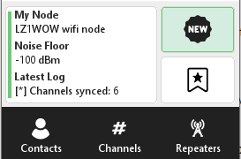 `MainMenuScreen` (2)</td>
    <td align="center">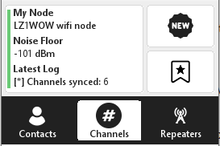 `MainMenuScreen` (3)</td>
  </tr>
  <tr>
    <td align="center">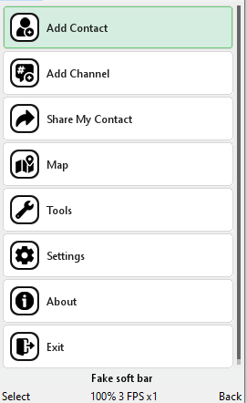 `MoreMenuCanvas`</td>
    <td align="center">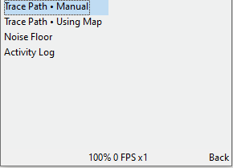 `ToolsScreen`</td>
    <td align="center">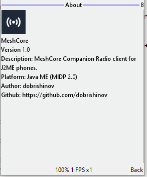 `AboutScreen`</td>
  </tr>
</table>

### 4.2 Messaging: channels and DMs (`3.3`)

<table>
  <tr>
    <td align="center">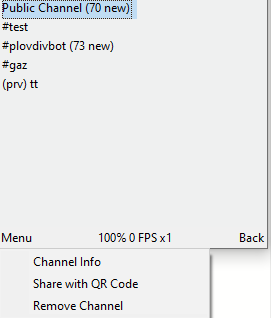 `ChannelListScreen`</td>
    <td align="center">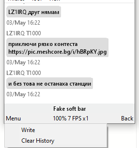 `ChannelScreen`</td>
    <td align="center">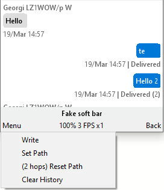 `DMScreen` (compose)</td>
  </tr>
  <tr>
    <td align="center">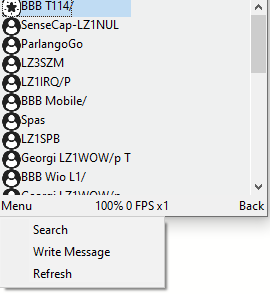 `ContactsScreen` (1)</td>
    <td align="center">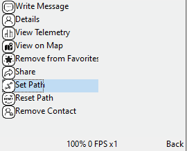 `ContactsScreen` (2)</td>
    <td align="center">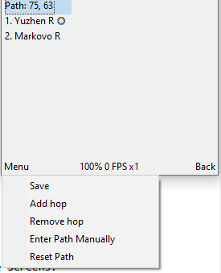 `PathListScreen`</td>
  </tr>
</table>

### 4.3 Add/share flows (`3.4`)

<table>
  <tr>
    <td align="center">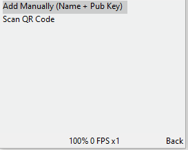 `AddContactOptionsScreen`</td>
    <td align="center">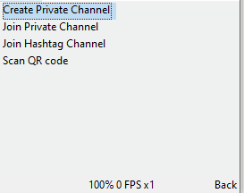 `AddChannelOptionsScreen`</td>
    <td align="center">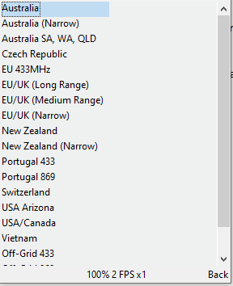 `MapSourceForm` (preset)</td>
  </tr>
  <tr>
    <td align="center">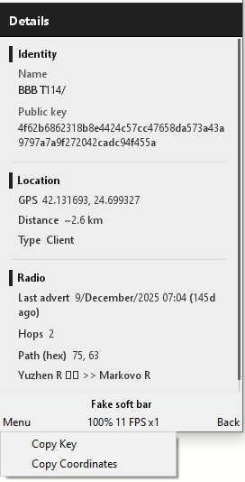 `ContactDetailsScreen`</td>
    <td align="center">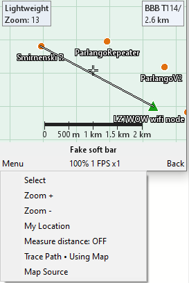 `MapViewCanvas` (contact 1)</td>
    <td align="center">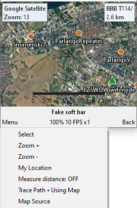 `MapViewCanvas` (contact 2)</td>
  </tr>
</table>

### 4.4 Repeaters and route tools (`3.5`)

<table>
  <tr>
    <td align="center">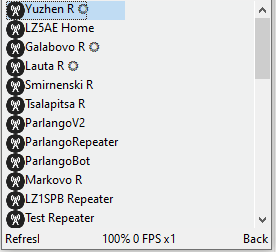 `RepeatersScreen`</td>
    <td align="center">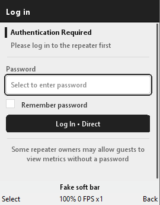 `RepeaterLoginScreen`</td>
    <td align="center">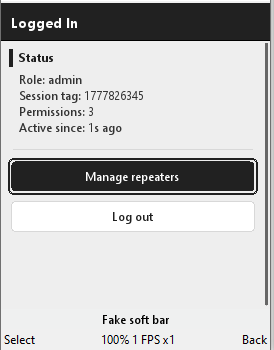 `RepeaterLoggedInScreen`</td>
  </tr>
  <tr>
    <td align="center">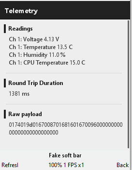 `TelemetryResultScreen` (repeater)</td>
    <td align="center">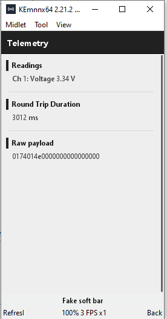 `TelemetryResultScreen` (contact)</td>
    <td align="center">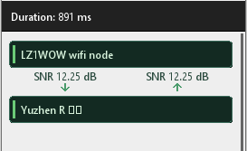 `PingZeroHopScreen`</td>
  </tr>
</table>

### 4.5 Trace path and map (`3.6`)

<table>
  <tr>
    <td align="center">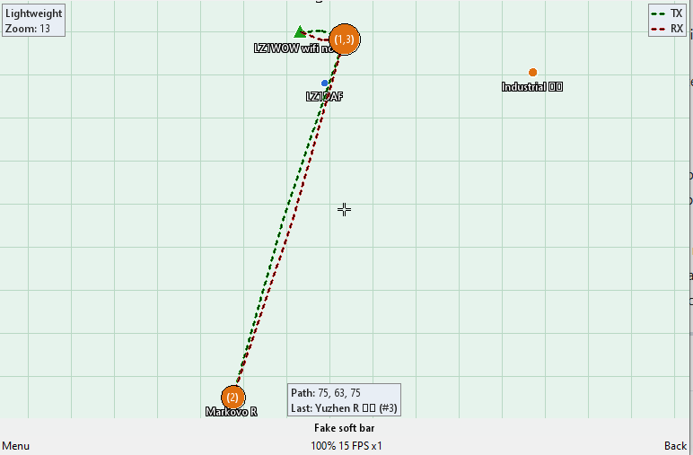 `MapViewCanvas` trace (1)</td>
    <td align="center">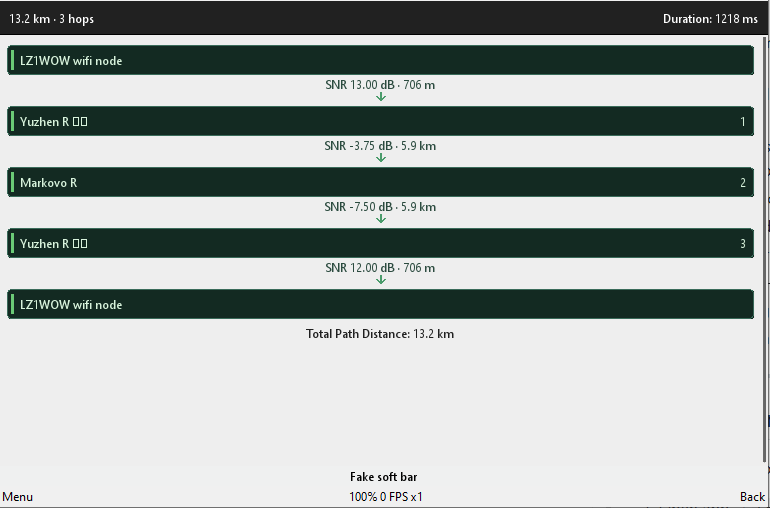 `MapViewCanvas` trace (2)</td>
    <td align="center"> `MapViewCanvas` trace (3)</td>
  </tr>
  <tr>
    <td align="center"> `MapViewCanvas` trace (4)</td>
    <td align="center">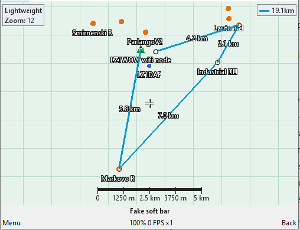 `MapViewCanvas` measure (1)</td>
    <td align="center">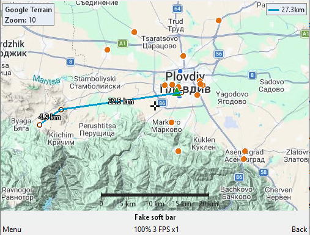 `MapViewCanvas` measure (2)</td>
  </tr>
</table>

### 4.6 Diagnostics, settings, and info (`3.7`)

<table>
  <tr>
    <td align="center">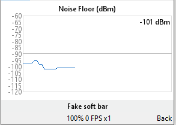 `NoiseFloorScreen`</td>
    <td align="center">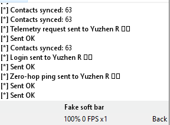 `ActivityLogScreen`</td>
    <td align="center">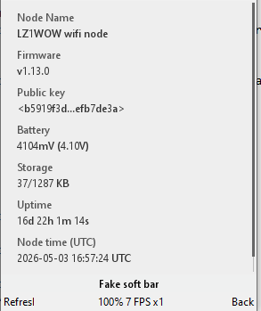 `DeviceInfoScreen`</td>
  </tr>
  <tr>
    <td align="center">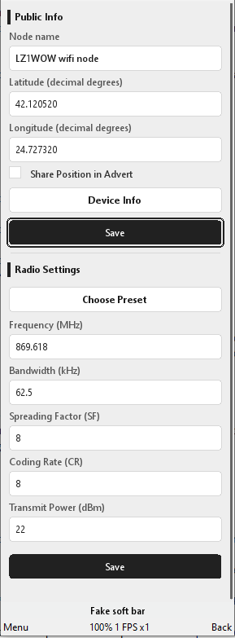 `SettingsScreen`</td>
    <td align="center">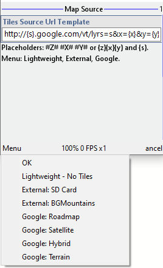 `MapSourceForm`</td>
    <td align="center"> `AboutScreen`</td>
  </tr>
</table>

---

## 5) What happens in the background

From the user's perspective:

- Incoming frames update chats, contacts, notifications, and dashboard info automatically.
- The UI refreshes asynchronously so it stays responsive while waiting for node responses.
- Request flows (trace/ping/telemetry/login) are handled by dedicated services that track pending state and support refresh/retry behavior.

Key background service groups:

- `ZeroHopPingService`
- `TracePathPingService`
- `TelemetryRequestService`
- `LoginRequestService`
- `DmSendManager`

---

## 6) Build and run

This is a Java ME app — not standard desktop Java.

1. Import the project sources into a Java ME capable SDK or IDE (e.g. NetBeans with the Mobility Pack, or a compatible toolchain).
2. Set the MIDlet entry point to `MeshCore`.
3. Ensure network (TCP) and RMS (storage) permissions are declared in the manifest/JAD file.
4. Build the JAR/JAD.
5. Deploy to a device or run in an emulator.

### Running on a physical device

Tested on **Nokia Asha 210**. Any MIDP 2.0 / CLDC 1.1 handset with Wi-Fi TCP and sufficient RMS storage should work.

### Running on desktop with KEmulator

**[KEmulator (kemnnx64)](https://github.com/shinovon/KEmulator/releases)** allows you to run the app on Windows, Linux, and macOS without a physical device.

1. Download the latest KEmulator release for your OS from the link above.
2. Launch KEmulator.
3. Load the built JAR file via the emulator's open/load function.
4. Ensure the emulator has network access to the same local network as your MeshCore node.
5. The app will run with full UI and TCP connectivity.

> KEmulator is useful for development, testing, and demonstration when a Java ME handset is not available.

---

## 7) Roadmap TODO

- Multibyte path support
- Repeater management
- Time Zone configuration
- Bug fixes
- Refactor (where needed)

---

## 8) Quick troubleshooting

- **Cannot connect:** verify the host/IP and port, and confirm the phone/emulator and node are on the same local network.
- **No contacts or repeaters visible:** wait for the initial sync to complete and use the `Refresh` action on the relevant screen.
- **Trace shows incomplete distance:** some hops may not have advertised GPS coordinates — distance is only shown for hops with location data.
- **Map looks empty or wrong:** check the map source template in `MapSourceForm`, and confirm network or SD card tile availability.
- **KEmulator network issues:** make sure the emulator's network interface can reach the MeshCore node's IP/port — check firewall rules on the host machine.